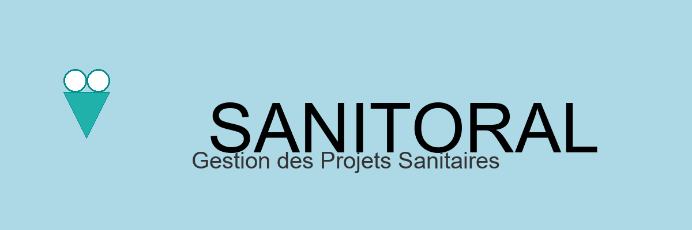

# P7demo - SANITORAL

Gestion des projets sanitaires - démo pour le P7 OCR

Dans le projet commun P7demo :

- cloner le projet P7demo

- créer votre branche

- Merger la branche ‘goudot’ chez vous pour récupérer le notebook à remplir
  Il propose de lire les données, faire une jointure, aggregation, graphique

- Mettre à jour le README avec un graphique

- Commit du README & image - pas le notebook modifié par chacun

- faire une pull request sur main

## Donnees

- Fichier source: data/Donnees+Sanitoral.xlsx
- Fichier export nettoyé: data/DonneesSanitoralNet.xlsx

### Chargement des données
Chaque onglet est chargé avec son propre header (index 0-based) :
- Projects_plans: 2
- Project type: 3
- Actual_Costs: 3
- Actual_Duration: 5
- Actual_Delivrable: 3
- Projects_Locations: 1
- Country_Profiles: 1

### Standardisation des identifiants Project

Les 7 sheets disposent de colonnes clés différentes pour identifier les projets :
| Sheet | Colonne clé originale |
|-------|----------------------|
| Projects_plans | Project ID |
| Project type | Project ID |
| Actual_Costs | Proj_ID |
| Actual_Duration | Project |
| Actual_Delivrable | ID |
| Projects_Locations | Project ID |
| Country_Profiles | (aucune) |

**Solution** : Création d'une colonne `Project_ID` uniformisée avec auto-increment (1, 2, 3, ...) pour tous les dataframes. Cela permet :
- Des jointures cohérentes entre tous les sheets
- Traçabilité des projets à travers toutes les tables
- Elimination des doublons d'identifiants

### Jointures
- **Jointure principale** : `Projects_plans` ⨝ `Actual_Duration` sur `Project_ID`
  - Type : LEFT JOIN (conservation de tous les projets planifiés)
  - Suffixes utilisés : `_planned` et `_actual`

## Visualisations

Exemple d'image (goudot) :

